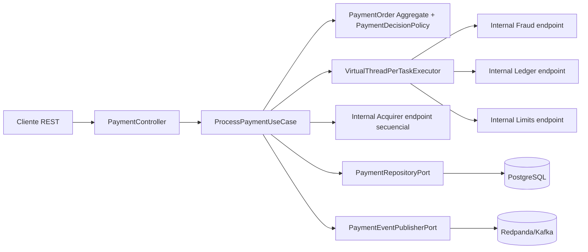

# Payment Virtual Threads PoC - Java + Spring Boot + DDD + Hexagonal

PoC de procesamiento de pagos con **Java**, **Spring Boot**, **Maven**, **arquitectura hexagonal**, **DDD** y **virtual threads**.

La funcionalidad principal expone un microservicio REST que procesa una orden de pago. El caso de uso orquesta 4 endpoints internos creados dentro del mismo microservicio:

1. `fraud-assessments` en paralelo.
2. `ledger-reservations` en paralelo.
3. `limits-validations` en paralelo.
4. `acquirer-authorizations` secuencial, solo si las 3 validaciones paralelas son exitosas.

Spring Boot atiende requests HTTP con virtual threads mediante:

```yaml
spring:
  threads:
    virtual:
      enabled: true
```

Además, el caso de uso usa `Executors.newVirtualThreadPerTaskExecutor()` para paralelizar las 3 llamadas internas.

## Arquitectura



## Estructura del proyecto

```text
payment-virtual-threads-poc/
├─ pom.xml
├─ README.md
├─ infraestructure/
│  ├─ docker-compose.yml
│  └─ datasets/
│     ├─ README.md
│     ├─ postgres/001_seed_payments.sql
│     └─ requests/*.json
└─ src/main/
   ├─ java/pe/com/poc/payments/
   │  ├─ domain/                 # Entidades, Value Objects, políticas de dominio
   │  ├─ application/             # Casos de uso y puertos
   │  └─ adapter/                 # Adaptadores web, HTTP, persistencia y mensajería
   └─ resources/
      ├─ application.yml
      ├─ properties.yml
      └─ db/migration/V1__create_payment_tables.sql
```

## Código principal

- `PaymentController`: endpoint REST público `POST /payments/v1/payment-orders`.
- `PaymentProcessingService`: caso de uso principal. Crea el agregado `PaymentOrder`, ejecuta 3 validaciones en paralelo con virtual threads y luego ejecuta la autorización secuencial.
- `PaymentOrder`: agregado DDD con estados `RECEIVED`, `APPROVED`, `DECLINED`.
- `PaymentDecisionPolicy`: regla de dominio para decidir si se puede autorizar.
- `InternalSimulationController`: simula los 4 servicios internos dentro del mismo microservicio.
- `InternalChecksHttpAdapter`: usa `RestClient` para llamar a los endpoints internos.
- `PaymentPersistenceAdapter`: persistencia PostgreSQL vía JPA.
- `KafkaPaymentEventPublisher`: publica evento `payments.processed.v1` en Redpanda/Kafka.

## Infraestructura

Desde la raíz del proyecto:

```bash
cd infraestructure
docker compose up -d
```

Componentes:

- PostgreSQL: `localhost:5432`, database `payments`.
- Redpanda Kafka API: `localhost:19092`.
- Redpanda Console: `http://localhost:8081`.

## Ejecutar el proyecto

Requisitos:

- JDK 21.
- Maven 3.9.x o superior.
- Docker / Docker Compose.

```bash
mvn clean spring-boot:run
```

O generar JAR:

```bash
mvn clean package
java -jar target/payment-virtual-threads-poc-0.0.1-SNAPSHOT.jar
```

## Probar pago aprobado

```bash
curl -X POST http://localhost:8080/payments/v1/payment-orders \
  -H "Content-Type: application/json" \
  -H "Idempotency-Key: demo-001" \
  -d @infraestructure/datasets/requests/payment-approved.json
```

Respuesta esperada:

```json
{
  "paymentId": "uuid",
  "status": "APPROVED",
  "authorizationCode": "AUTH-...",
  "declineReason": null
}
```

## Probar pago rechazado por límite

```bash
curl -X POST http://localhost:8080/payments/v1/payment-orders \
  -H "Content-Type: application/json" \
  -H "Idempotency-Key: demo-002" \
  -d @infraestructure/datasets/requests/payment-declined-limit.json
```

## Notas

Con Spring Boot los virtual threads se habilitan con Java 21+ usando `spring.threads.virtual.enabled=true`
